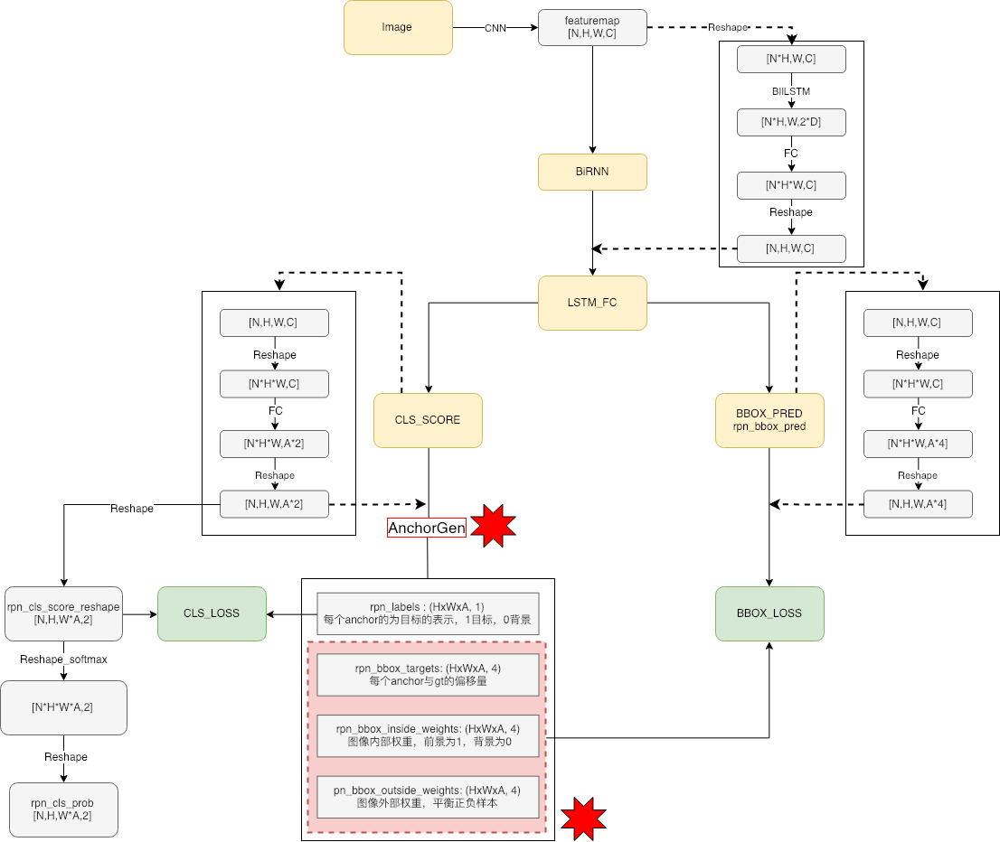
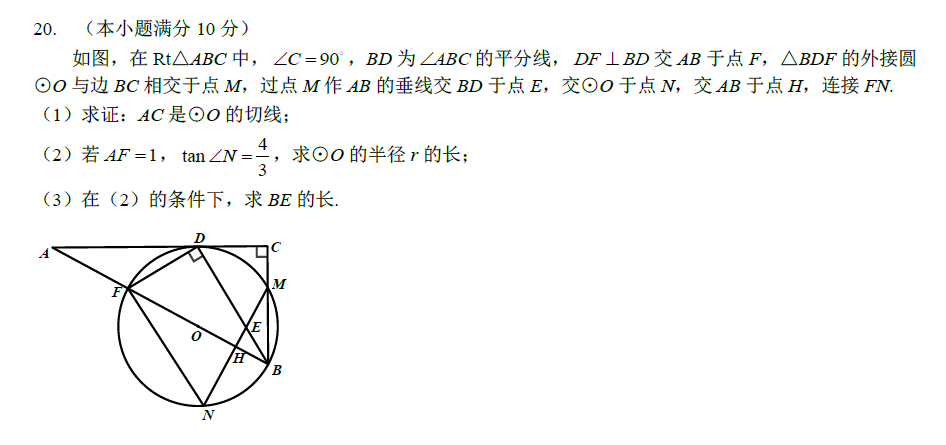
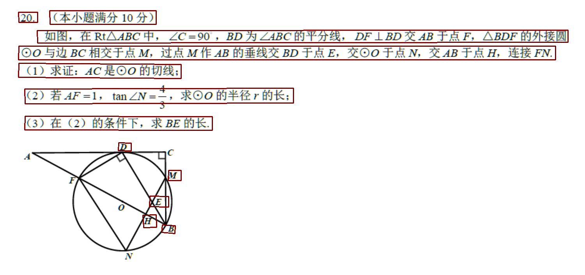
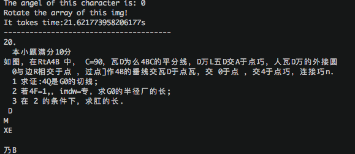
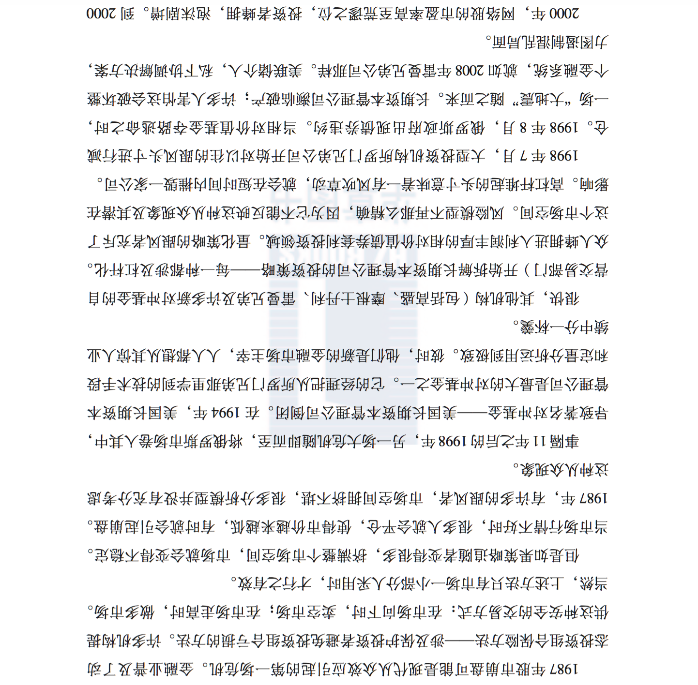
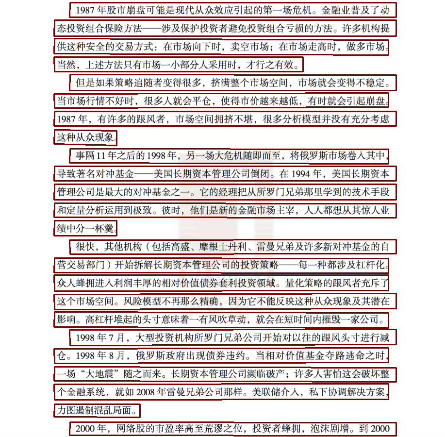
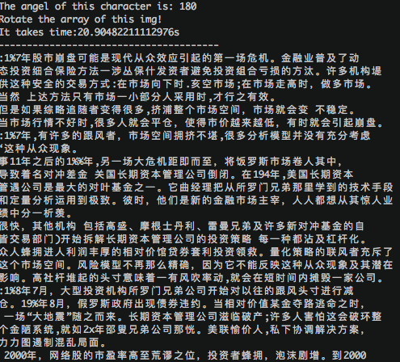

# 本文基于tensorflow、keras/pytorch实现对自然场景的文字检测及端到端的OCR中文文字识别

# 实现功能

- 文字方向检测 0、90、180、270度检测 
- 文字检测 后期将切换到keras版本文本检测 实现keras端到端的文本检测及识别
- 不定长OCR识别

## 环境部署

``` 
Bash
##GPU环境
sh setup.sh
## CPU环境
sh setup-cpu.sh
##CPU python3环境
sh setup-python3.sh

使用环境：python3.6+tensorflow1.7+cpu/gpu
```

# 模型训练
* 一共分为3个网络
	 	**1. 文本方向检测网络-Classify(vgg16)**
*  **2. 文本区域检测网络-CTPN(CNN+RNN)**
*  **3. EndToEnd文本识别网络-CRNN(CNN+GRU/LSTM+CTC)**

# 文字方向检测-vgg分类
```bash
基于图像分类，在VGG16模型的基础上，训练0、90、180、270度检测的分类模型.
详细代码参考angle/predict.py文件，训练图片8000张，准确率88.23%
```
模型地址[BaiduCloud](https://pan.baidu.com/s/1zquQNdO0MUsLMsuwxbgPYg)

# 文字区域检测CTPN

关于ctpn网络，网上有很多对其进行介绍讲解的，算法是2016年提出的，在印书体识别用的很多，本人也写过一篇相应的博文[深度学习-TextDetection](http://xiaofengshi.com/2019/01/23/%E6%B7%B1%E5%BA%A6%E5%AD%A6%E4%B9%A0-TextDetection/)，在文章中结合本repo的代码对ctpn的原理进行了详细的讲解。CTPN网路结构如下



ctpn是一种基于目标检测方法的文本检测模型，在本repo的ctpn中anchor的设置为固定宽度，高度不同，相关代码如下：

```python
def generate_anchors(base_size=16, ratios=[0.5, 1, 2],
                     scales=2 ** np.arange(3, 6)):
    heights = [11, 16, 23, 33, 48, 68, 97, 139, 198, 283]
    widths = [16]
    sizes = []
    for h in heights:
        for w in widths:
            sizes.append((h, w))
    return generate_basic_anchors(sizes)
```

基于这种设置，ctpn只能检测水平方向的文本，如果想要ctpn可以支持垂直文本检测，可以在anchor生成函数上进行修改。更详细的内容可以参考博客讲解。

# OCR 端到端识别:CRNN

## ocr识别采用GRU+CTC端到到识别技术，实现不分隔识别不定长文字

提供keras 与pytorch版本的训练代码，在理解keras的基础上，可以切换到pytorch版本，此版本更稳定
- 此外参考了了tensorflow版本的资源仓库：[TF:LSTM-CTC_loss](https://github.com/xiaofengShi/CTC_TF) 

## 为什么使用ctc

ctc是一种解码机制，在使用ctpn提取到待检测文本行之后，我们要识别提取到的区域内的文本内容，目前广泛存在两种解码机制。

一种是seq2seq机制，输入的是图像，经过卷积编码之后再使用RNN解码，为了提高识别的准确率，一般会加入attention机制。

另一种就是ctc解码机制，但是对于ctc解码要满足一个前提，那就是输入序列的长度不小于输出序列的长度。ctc主要用于序列解码，我们不需要对序列中的每个元素进行标记，只需要知道输入序列对应的整个label是什么即可，针对ocr项目，也就是输入一张图像上面写着“欢迎来到中国”这几个字，我们只需要是这几个字，而没必要知道这几个字在输入图像中所在的具体位置，实际上如果知道每个字所在的位置，就是单字符识别了，的确会降低任务的复杂多，但是现实中我们没有这么多标记号位置的数据，这个时候CTC就显得很重要了。关于ctc解码机制，本人同样谢了一个对应的博客[CTC算法原理](http://xiaofengshi.com/2019/02/14/CTC%E7%AE%97%E6%B3%95%E5%8E%9F%E7%90%86/)，在文章中进行了详细的讲解，，如有疑问，请提交提问。

本repo中使用的是CNN+RNN+CTC的机制，实际上可以使用CNN+CTC的机制，CNN推荐选择densenet或者resnet

# 使用说明

## 使用预训练测试

```
运行demo.py  写入测试图片的路径即可，如果想要显示ctpn的结果，修改文件./ctpn/ctpn/other.py 的draw_boxes函数的最后部分，cv2.inwrite('dest_path',img)，如此，可以得到ctpn检测的文字区域框以及图像的ocr识别结果
```
## 使用自己的数据训练

### 1 对ctpn进行训练
* 定位到路径--./ctpn/ctpn/train_net.py
* 预训练的vgg网络路径[VGG_imagenet.npy](https://pan.baidu.com/s/1JO_ZojA5bkmJZsnxsShgkg)
将预训练权重下载下来，pretrained_model指向该路径即可,
此外整个模型的预训练权重[checkpoint](https://pan.baidu.com/s/1aT-vHgq7nvLy4M_T6SwR1Q)
* ctpn数据集[还是百度云](https://pan.baidu.com/s/1NXFmdP_OgRF42xfHXUhBHQ)
数据集下载完成并解压后，将.ctpn/lib/datasets/pascal_voc.py 文件中的pascal_voc 类中的参数self.devkit_path指向数据集的路径即可

### 2 对crnn进行训练

* keras版本 ./train/keras_train/train_batch.py  model_path--指向预训练权重位置 
MODEL_PATH---指向模型训练保存的位置
[keras模型预训练权重](https://pan.baidu.com/s/1vTG6-i_bFMWxQ_7xF06usg)
* pythorch版本./train/pytorch-train/crnn_main.py
```
parser.add_argument(
    '--crnn',
    help="path to crnn (to continue training)",
    default=预训练权重的路径，看你下载的预训练权重在哪啦)
parser.add_argument(
    '--experiment',
    help='Where to store samples and models',
    default=模型训练的权重保存位置,这个自己指定)
```
[pytorch预训练权重](https://pan.baidu.com/s/1LEDNHEr3luloB7eZK6GOeA)


# 识别结果展示
## 文字检测及OCR识别结果


`===========================================================`

`===========================================================`


主要是因为训练的时候，只包含中文和英文字母，因此很多公式结构是识别不出来的
### 看看纯文字的

`===========================================================`

`===========================================================`


# 未完待续

### tensorflow版本crnn，计划尝试当前的各种trick(dropuout,bn,learning_decay等)
```
可以看到，对于纯文字的识别结果还是阔以的呢，感觉可以在crnn网络在加以改进，现在的crnn中的cnn有点浅，
并且rnn层为单层双向+attention，目前正在针对这个地方进行改动，使用迁移学习，以restnet为特征提取层，
使用多层双向动态rnn+attention+ctc的机制，将模型加深，目前正在进行模型搭建，结果好的话就发上来，不好的话只能凉凉了~~~~
```

## 训练数据集补充

列举可用于文本检测和识别领域模型训练的一些大型公开数据集， 不涉及仅用于模型fine-tune任务的小型数据集。

### **Chinese Text in the Wild(CTW)**

该数据集包含32285张图像，1018402个中文字符(来自于腾讯街景), 包含平面文本，凸起文本，城市文本，农村文本，低亮度文本，远处文本，部分遮挡文本。图像大小2048*2048，数据集大小为31GB。以(8:1:1)的比例将数据集分为训练集(25887张图像，812872个汉字)，测试集(3269张图像，103519个汉字)，验证集(3129张图像，103519个汉字)。

```
文献链接：https://arxiv.org/pdf/1803.00085.pdf 
数据集下载地址：https://ctwdataset.github.io/
```

### **Reading Chinese Text in the Wild(RCTW-17)**

该数据集包含12263张图像，训练集8034张，测试集4229张，共11.4GB。大部分图像由手机相机拍摄，含有少量的屏幕截图，图像中包含中文文本与少量英文文本。图像分辨率大小不等。

```
http://mclab.eic.hust.edu.cn/icdar2017chinese/dataset.html
文献：http://arxiv.org/pdf/1708.09585v2
```

### ICPR MWI 2018 挑战赛

大赛提供20000张图像作为数据集，其中50%作为训练集，50%作为测试集。主要由合成图像，产品描述，网络广告构成。该数据集数据量充分，中英文混合，涵盖数十种字体，字体大小不一，多种版式，背景复杂。文件大小为2GB。

```
https://tianchi.aliyun.com/competition/information.htm?raceId=231651&_is_login_redirect=true&accounttraceid=595a06c3-7530-4b8a-ad3d-40165e22dbfe
```

### **Total-Text**

该数据集共1555张图像，11459文本行，包含水平文本，倾斜文本，弯曲文本。文件大小441MB。大部分为英文文本，少量中文文本。训练集：1255张 测试集：300

```
http://www.cs-chan.com/source/ICDAR2017/totaltext.zip
http:// arxiv.org/pdf/1710.10400v
```

### Google FSNS(谷歌街景文本数据集)

该数据集是从谷歌法国街景图片上获得的一百多万张街道名字标志，每一张包含同一街道标志牌的不同视角，图像大小为600*150，训练集1044868张，验证集16150张，测试集20404张。

```
http://rrc.cvc.uab.es/?ch=6&com=downloads
http:// arxiv.org/pdf/1702.03970v1
```

### **COCO-TEXT**

该数据集，包括63686幅图像，173589个文本实例，包括手写版和打印版，清晰版和非清晰版。文件大小12.58GB，训练集：43686张，测试集：10000张，验证集：10000张

```
http://arxiv.org/pdf/1601.07140v2
https://vision.cornell.edu/se3/coco-text-2/
```

### **Synthetic Data for Text Localisation**

在复杂背景下人工合成的自然场景文本数据。包含858750张图像，共7266866个单词实例，28971487个字符，文件大小为41GB。该合成算法，不需要人工标注就可知道文字的label信息和位置信息，可得到大量自然场景文本标注数据。

```
下载地址：http://www.robots.ox.ac.uk/~vgg/data/scenetext/
文献：http://www.robots.ox.ac.uk/~ankush/textloc.pdf
Code: https://github.com/ankush-me/SynthText (英文版)
Code https://github.com/wang-tf/Chinese_OCR_synthetic_data(中文版)
```

### **Synthetic Word Dataset**

合成文本识别数据集，包含9百万张图像，涵盖了9万个英语单词。文件大小为10GB

```
http://www.robots.ox.ac.uk/~vgg/data/text/
```

### **Caffe-ocr中文合成数据**

数据利用中文语料库，通过字体、大小、灰度、模糊、透视、拉伸等变化随机生成，共360万张图片，图像分辨率为280x32，涵盖了汉字、标点、英文、数字共5990个字符。文件大小约为8.6GB

```
https://pan.baidu.com/s/1dFda6R3
```

## 参考

- [深度学习-OCR_Overview](http://xiaofengshi.com/2019/01/05/%E6%B7%B1%E5%BA%A6%E5%AD%A6%E4%B9%A0-OCR_Overview/)
- [pytorch 实现crnn](https://github.com/meijieru/crnn.pytorch.git)    
- [keras-crnn 版本实现参考](https://www.zhihu.com/question/59645822)  
- [tensorflow-crnn](https://github.com/ilovin/lstm_ctc_ocr)
- [tensorflow-ctpn](https://github.com/eragonruan/text-detection-ctpn )
- [CAFFE-CTPN](https://github.com/tianzhi0549/CTPN)

